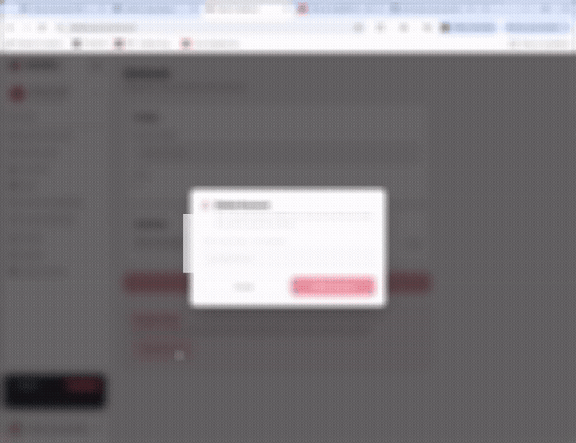

# OpenClaw / ClawBro Account Deletion – QA Reproduction



*Redacted preview from the supplied reproduction recording.* [Watch the full redacted video](evidence/account-deletion-reproduction-redacted.mp4).

A portfolio-ready QA case study documenting a reported account-deletion failure, challenging the available evidence, and building safe, reproducible browser coverage.

> **Evidence limit:** the recording shows no visible completion state after the final interaction in that session. It does not establish whether the request reached the server or what happened to the account. Root cause remains unknown.

## Bug at a glance

**Title:** Account deletion action does not complete after valid email confirmation  
**Category:** Functional / Account lifecycle / Account management  
**Proposed severity:** High – user-requested account deletion is blocked  
**Affected surface observed in evidence:** `https://clawbro.ai/pt/dashboard`  
**Evidence:** `evidence/account-deletion-reproduction-redacted.mp4` and screenshots in `evidence/screenshots/`

### Reproduction flow

1. Sign in to the account.
2. Open the **Account** settings page.
3. Scroll to **Danger Zone**.
4. Click **Delete Account**.
5. Enter the account email into **TYPE YOUR EMAIL TO CONFIRM**.
6. Click **Delete Account** in the confirmation modal.
7. Observe that the deletion flow does not complete and the modal remains visible in the recording.

### Expected

A valid confirmation should submit the deletion request and the UI should transition to the documented success state, such as account deletion confirmation, sign-out, redirect, or another explicit completion state.

### Actual in the supplied recording

The modal remains visible and there is no captured success/redirect state. This is an observation from one recording, not independent reproduction or proof of server-side account state.

## Automated coverage and safety

The primary automated suite is Python + Playwright against a local HTML contract harness. The deletion endpoint is fulfilled by a request mock; no OpenClaw account, service, or credential is used. This proves the harness and assertions work, not that the production defect has been reproduced.

The TypeScript live probe is opt-in (`RUN_LIVE_PROBE=true`) and aborts every HTTP request after the confirmation value is entered. It observes request intent only and is not proof of successful deletion. Do not provide credentials to an assistant or commit authentication state.

### Run local Python browser tests

```bash
python -m pip install -r requirements-test.txt
python -m playwright install chromium
python -m pytest -q tests/test_account_deletion.py
```

### Optional TypeScript suite

```bash
npm test
```

The live probe stays skipped unless explicitly opted in and supplied with an authenticated storage state and email. Do not run it against a real account as a deletion regression test.

## Evidence

The public-safe evidence copy has the account email blurred. The original recording should not be committed to a public repository because it contains personal information.

- `evidence/account-deletion-reproduction-redacted.mp4`
- `evidence/screenshots/frame-01.png` – Account page / Danger Zone
- `evidence/screenshots/frame-03.png` – Delete Account confirmation modal
- `evidence/screenshots/frame-07.png` – Email entered and final button clicked
- `evidence/screenshots/frame-09.png` – DOM inspection of the final button

## Related OpenClaw reporting guidance

OpenClaw's current security/reporting guidance says that ClawHub issues belong in `openclaw/clawhub`, and that `security@openclaw.ai` can route reports when the correct destination is unclear. The ClawHub security policy also treats website/API/authentication issues as platform-level reports. See the sources listed in `docs/sources.md`.

## QA case study artifacts

See the case-study documents:

- `docs/QA_STRATEGY.md` – prioritized, risk-based coverage strategy.
- `docs/TEST_PLAN.md` – cases, preconditions, run instructions, and limits.
- `docs/BUG_REPORT.md` – evidence-based report with alternative explanations and missing evidence.
- `docs/INVESTIGATION_LOG.md` – investigation history, changes, and remaining risks.
- `docs/technical-observations.md` – evidence-based observations from the recording, without claiming an unverified root cause.
- `docs/outreach-email.md` – professional outreach message to the product/engineering team.
- `docs/professional-context.md` – concise profile context for presenting the author as a QA/full-stack candidate.
